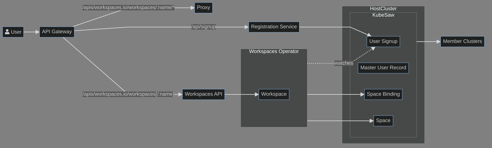

# Workspaces

This repository contains the following components:

* The [Workspaces Operator](./operator/README.md)
* The [REST over HTTP Server](./server/README.md)
* The [End-To-End Tests](./e2e/README.md)



## Demo

Log in an OpenShift cluster as admin

```console
export QUAY_NAMESPACE=<your QUAY namespace>

./hack/demo.sh
```
