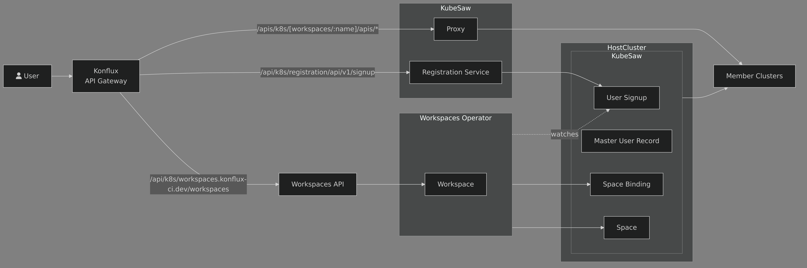

# Architecture

The Konflux-Workspaces suite is composed by the following modules:
- The [REST over HTTP Server](./rest-api/rest-api.md)
- The [Workspaces Operator](./operator/operator.md)

It also require [KubeSaw](https://github.com/codeready-toolchain) to be installed in the cluster.
